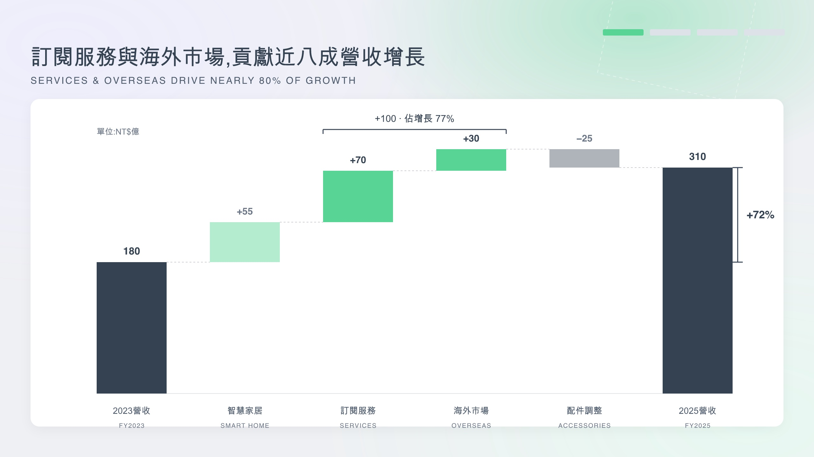
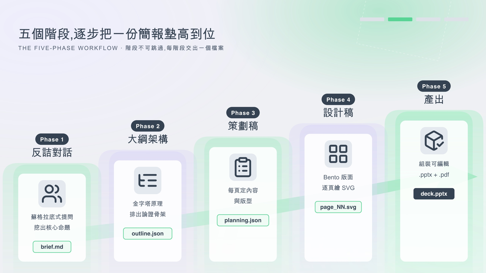
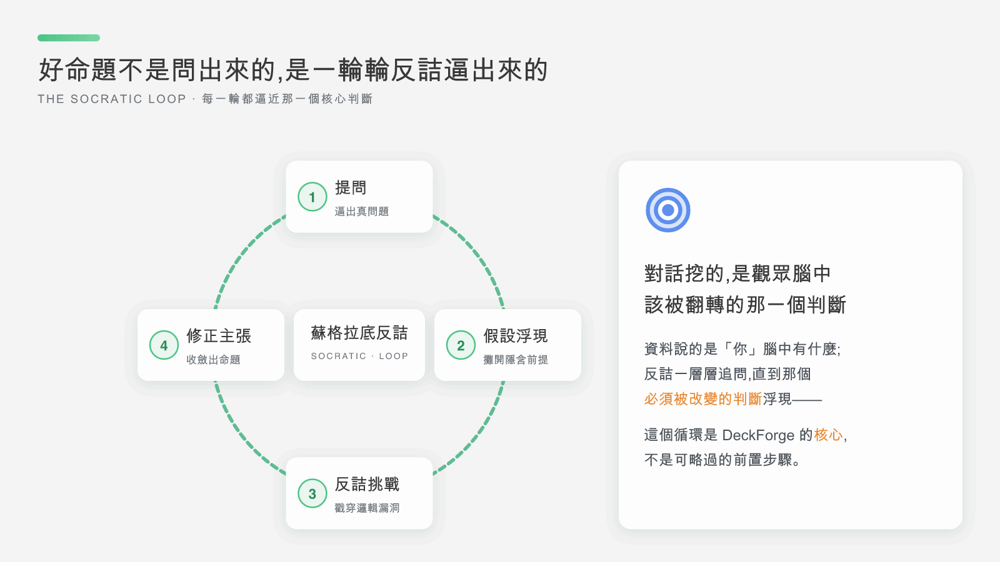

# DeckForge — a deck's soul is its content, and design makes it seen

**English** · [繁體中文](README.md)

> A Claude skill that produces **professional, editable PowerPoint decks**. It doesn't stuff your topic into a template — it chains three load-bearing methodologies into one workflow: **Socratic dialogue** (Phase 1) surfaces the one judgment the deck must change, the **pyramid principle** (Phase 1→2→3) structures scattered ideas into a readable argument, and **Bento Grid + a three-family design system** (Phase 3→4 — IT_prism cool light style by default, with corporate-fresh warm consulting and dark Apple on request) renders that argument as an editable PPT. Not a one-shot generator — every phase boundary asks for your approval before advancing.


## Demo

Five showcase slides — each demonstrates one layout and one capability, all produced directly through this skill's SVG pipeline (default IT_prism cool light style):

| Cover · reeded glass | Consulting chart · waterfall | Glass flow · 5-phase |
|:--:|:--:|:--:|
|  |  |  |
| **Editable output · lead + pair** | **Motion · the Socratic loop** | **One deck, five layouts** |
|  |  | Cards · charts · diagrams · flows · loops — layout follows content, never a template. |

Slide 5 shows the **animated flow edges** (`flow-anim`) feature as actually produced: the pulse dashes on the loop keep circling in PowerPoint / Keynote slideshow mode (the GIF above is exactly what gets embedded in the slide). Animated pages ship as embedded GIFs and only move in slideshow mode; the price is that **those slides are not Convert-to-Shape editable** and render static in the PDF — so each deck caps at 2–3 motion pages, reserved for its most critical process or loop pages.

- Source SVGs for these five pages (peek at the Bento Grid coordinates, or drag one into PowerPoint to inspect): [`examples/showcase/`](examples/showcase/)
- Also a full 10-page example deck and combined PDF: [`examples/sample-deck/`](examples/sample-deck/) · [`examples/DeckForge-demo.pdf`](examples/DeckForge-demo.pdf)


## Why SVG → PPTX (not template-based, not raster)?

- SVG is a vector format natively supported by PowerPoint 2016+. The converter splits each slide into a movable background image + an editable content layer: right-click → *Convert to Shape* to edit text, cards, lines and icons; gradients, glassmorphism and shadows ride along in the (movable) background image.
- Layouts can be designed around the *content*, not crammed into a fixed template.
- Every deck gets its own palette + visual motif, consistent across all slides (the skill enforces this).
- See [`references/editable_mode.md`](references/editable_mode.md) for the editing details.

## Credits & methodology

- **Starting point**: the essay "应该是目前最强的PPT Agent,附上完整思路分享" by *sandun* on linux.do. The "top-tier PPT structure architect" and Bento Grid prompts (`prompts/02_outline_architect.md`, `references/bento_grid.md`) are adaptations of his prompts with extensions; SVG as the deliverable format is also that essay's key choice.
- **Core methodology #1 — Socratic dialogue**: a philosophical form of inquiry through sustained questioning. It leads the interlocutor to examine their own view, exposes the hidden assumptions and logical gaps in it, invites the admission of not-knowing, and pursues objective truth.
- **Core methodology #2 — Pyramid Principle** (Barbara Minto): "conclusion first, then unpack the supporting points layer by layer top-down," so the audience grasps the core message in the shortest possible time.
- **SVG as the final format**: chosen to preserve editability inside PowerPoint, rather than shipping static images only.
- **Bento Grid design language**: the card-grid layout popularized by Apple's product pages.

## Install (Claude Desktop)

Two steps:

### 1. Download the zip + install three Python packages

```bash
# Download the latest release zip
curl -L -o ~/Downloads/deckforge.zip \
  https://github.com/yeevclaw/deckforge/releases/latest/download/deckforge.zip

# Install the three Phase 5 dependencies (same line on macOS / Linux / Windows)
pip install python-pptx resvg-py img2pdf --break-system-packages
```

> Don't use a terminal? Visit the [releases page](https://github.com/yeevclaw/deckforge/releases/latest), download `deckforge.zip` directly, and run only the `pip install` line in a terminal.

Just three packages — **zero system dependencies**. `resvg-py` bundles a Rust SVG renderer as a pip wheel; no Homebrew, no apt-get, no sudo needed:

- `python-pptx` → assembles the `.pptx`
- `resvg-py` → rasterizes SVGs to PNG (the fallback Keynote / Preview / older PowerPoint reads)
- `img2pdf` → assembles the same PNGs into a companion `.pdf`

Phases 1–4 (Socratic dialogue / outline / planning / design) are pure Markdown and need no packages at all; only Phase 5 uses the three above.

> Phase 5 produces **both `.pptx` and `.pdf` by default** — PPTX is the editable artifact for PowerPoint users; PDF is the universal artifact for direct sharing / clients / anyone without PowerPoint.

### 2. Import the zip in Claude Desktop

1. Open Claude Desktop → **Customize** (top-right).
2. Left nav **Skills** → click **`+`** → **Create skill** → **Upload a skill**.
3. Pick `~/Downloads/deckforge.zip`.
4. `deckforge` appears under *Personal skills*.

Done. Ask Claude "**Build me a deck about XXX**" and the skill triggers automatically.

> **Updating to a new version**: download the new zip from the releases page, delete the old `deckforge` in Customize → Skills, and Upload a skill again.

## How to use

Tell Claude in Claude Desktop:

> Tip: Claude Desktop supports drag-and-drop files. If the deck is based on an existing document (annual report, whitepaper, paper, issue brief), drop the file in together with the topic — the skill runs Phase 0 (source analysis) before outlining, and the result is much better.

- "**Build me a deck about XXX**"
- "幫我做一份簡報,主題是 XXX"
- "Make a Series B fundraising pitch"
- "Client proposal deck, 10 pages"

Claude triggers DeckForge automatically and runs the full workflow:

| Phase | Output | What you do |
|---|---|---|
| 0. Source analysis (optional) | `analysis.md` | Runs automatically when you drop a document; skipped otherwise |
| 1. **Socratic clarification** | `brief.md` | **Pop-up dialogue** surfaces the judgment the deck must actually change (thesis / belief shift / proof pillars / objection / desired action) |
| 2. Outline architecture | `outline.json` | Expanded with the **pyramid principle** — every page title is a claim, MECE-aligned with the proof pillars; **reviewing the title sequence** takes 30 seconds to change direction |
| 3. Planning draft | `planning.json` | **Review each page's content**; rewording costs 1 minute ← *the step most AI tools skip* |
| 4. SVG design | `pages/page_NN.svg` | One vector page per slide, generated automatically |
| 5. Produce | `presentation.pptx` + companion `.pdf` (+ `.notes.md` if speaker notes exist) | Assembled automatically; fully editable in PowerPoint 2016+ via Convert to Shape |

Every phase boundary pops up for your approval before advancing — no silent transitions.

The skill is **NOT** a one-shot generator. It deliberately places checkpoints after the outline and after the planning draft, so you can change direction at the cheapest possible cost — before any design effort is spent.


## What's inside

```
DeckForge/
├── SKILL.md                ← skill entry — Claude reads this first
├── prompts/                ← 6 phase prompts
│   ├── 00_source_analysis.md  ← Phase 0: source analysis (optional)
│   ├── 01_needs_research.md   ← Phase 1: Socratic Clarification Loop
│   ├── 02_outline_architect.md ← Phase 2: outline
│   ├── 03_content_research.md ← Phase 2.5: web research (optional)
│   ├── 04_planning_draft.md   ← Phase 3: planning draft (with extraction examples)
│   └── 05_designer_svg.md     ← Phase 4: SVG design
├── references/             ← detailed knowledge bases
│   ├── bento_grid.md       ← 8 Bento Grid layouts (the default; incl. stat_hero / mini_grid)
│   ├── diagrams.md         ← 9 diagram primitives (used only when bento loses information)
│   ├── chart_anatomy.md    ← 10 SVG chart types: the basic three + the consulting five (waterfall / stacked / hbar / combo / mekko) + two specialized (radar assessment / gantt schedule) + the annotation layer (CAGR arrows, difference brackets, reference lines — the chart carries its own analysis)
│   ├── design_system.md    ← IT_prism cool light style (default) + corporate_fresh warm consulting + dark_apple palette + 10 traditional palettes
│   ├── pyramid_principle.md ← pyramid-principle map across Phases 1/2/3
│   ├── socratic_loop.md    ← Phase 1 question types + 11 scenario spines
│   └── editable_mode.md    ← how Convert-to-Shape editing works in PowerPoint
├── templates/              ← 57 SVG files (56 starting templates + `_base.svg`), viewBox 0 0 1280 720
│   ├── _base.svg           ← shared filters / gradients / 44 Lucide icons
│   ├── cover.svg / toc.svg
│   ├── bento_2col.svg / bento_3col.svg / bento_hero.svg / bento_mixed.svg
│   ├── bento_mini_grid.svg ← main card + 3–5 mini-cards (dark_apple style)
│   ├── chart_bar.svg / chart_line.svg / chart_donut.svg
│   ├── chart_hbar.svg / chart_stacked_bar.svg / chart_waterfall.svg /
│   │   chart_combo.svg / chart_mekko.svg ← the consulting five: ranking / mix shift / bridge / volume+rate / market map
│   ├── chart_radar.svg / chart_gantt.svg ← two specialized: assessment radar / project schedule
│   ├── flow.svg / timeline.svg / cycle.svg / funnel.svg / compare_table.svg /
│   │   quadrant_2x2.svg / venn.svg / hierarchy_tree.svg / pyramid.svg ← diagram primitives
│   ├── prism_cover.svg / prism_compare.svg ← IT_prism (default family) reeded-glass cover & compare-table starters
│   ├── prism_3col*.svg (4) / prism_mini_grid*.svg (3) / prism_2col*.svg (2) ← IT_prism card_variant families
│   ├── prism_flow*.svg (4)                 ← the IT_prism flow_variant compositions
│   ├── fresh_cover.svg / fresh_compare.svg ← corporate_fresh cover & compare-table starters
│   ├── fresh_3col.svg / fresh_3col_steps.svg / fresh_3col_axis.svg / fresh_3col_lead.svg
│   │                       ← the 4 three_col card_variant compositions (picked per page by content sub-shape)
│   ├── fresh_mini_grid.svg / fresh_mini_grid_ribbon.svg / fresh_mini_grid_spotlight.svg
│   │                       ← the 3 mini_grid KPI-grid card_variant compositions
│   ├── fresh_2col.svg / fresh_2col_beforeafter.svg ← the 2 two_col_50_50 card_variant compositions
│   └── fresh_flow.svg / fresh_flow_terrace.svg / fresh_flow_river.svg / fresh_flow_cascade.svg
│                           ← the 4 glass-flow compositions for static flow pages (one per deck)
├── scripts/
│   ├── svg_to_pptx.py      ← Phase 5 assembler: two-layer editable slides + flow-anim GIF; emits .pptx + .pdf
│   ├── package.sh          ← build deckforge.zip for Claude Desktop upload
│   ├── setup.sh            ← one-line dependency installer (mac / linux)
│   └── setup.ps1           ← same, for Windows PowerShell
└── examples/               ← DeckForge self-intro mini-deck (10 pages, full output)
    ├── DeckForge-demo.pdf  ← combined rendered PDF
    ├── slide-1.jpg ... slide-4.jpg + slide-5.gif ← showcase previews (page 5 is an animated GIF)
    ├── showcase/           ← the 5 showcase slides (SVG sources)
    └── sample-deck/        ← source SVG pages of the 10-page demo
```

## For developers / forks

If you want to modify the skill, contribute upstream, or use Claude Code CLI:

```bash
# Clone the full source
git clone https://github.com/yeevclaw/deckforge.git ~/deckforge
cd ~/deckforge

# After editing, repackage into a zip for Claude Desktop
bash scripts/package.sh
# Produces ~/deckforge.zip — import it in Customize → Skills.

# Or: use Claude Code CLI
git clone https://github.com/yeevclaw/deckforge.git ~/.claude/skills/deckforge
bash ~/.claude/skills/deckforge/scripts/setup.sh
```

`scripts/package.sh` reads `name:` from SKILL.md so the zip's wrapper folder matches the skill name; it excludes `.git`, `.DS_Store`, `__pycache__`, and similar noise. On Windows use `scripts/setup.ps1` instead of `setup.sh`.

## License

[MIT](LICENSE) — use freely, fork, modify. Attribution to the original article is appreciated when you share.
